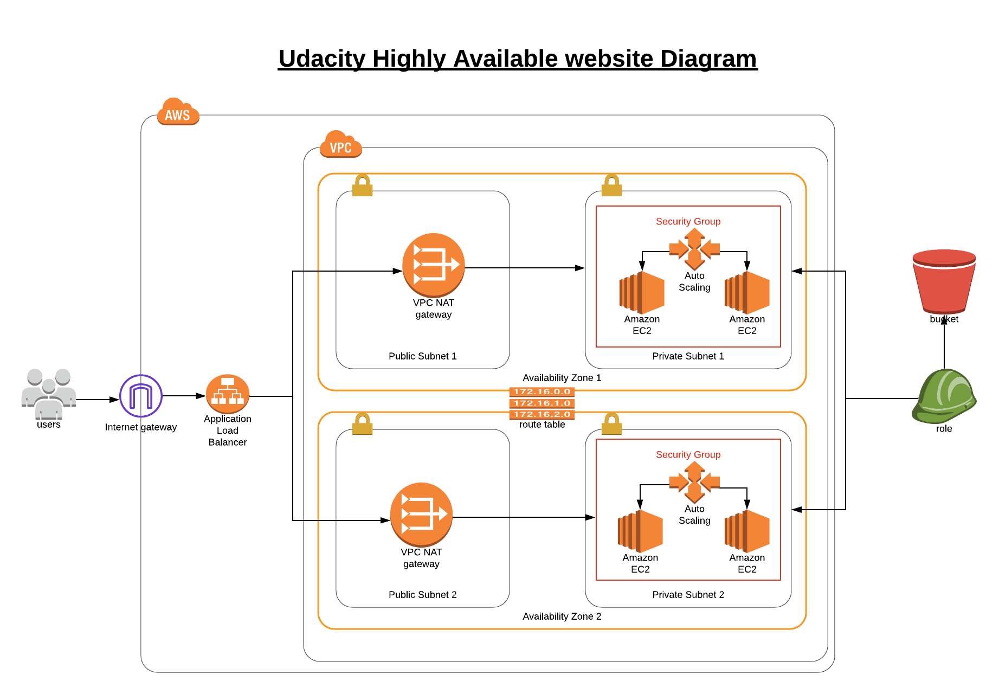

# Udacity Cloud DevOps Engineer Nanodegree

## Deploy a high-availability web app using CloudFormation

### Architecture


To Deploy the project You need to Run this command:

```
./create.sh network network.yml network-params.json
./create.sh infra infrastructure.yml infra-params.json
```

To Update the project You need to Run this command:

```
./update.sh network network.yml network-params.json
./update.sh infra infrastructure.yml infra-params.json
```

[Deployed Project Link](http://infra-applo-1hlzb1c4fzmtm-2133147487.us-west-2.elb.amazonaws.com/)
